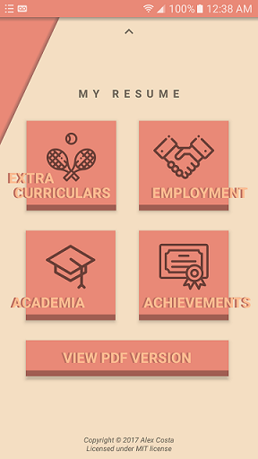
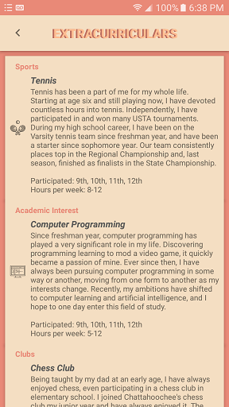
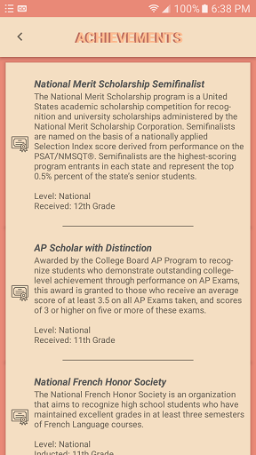

# My Interactive Resume
This is a personal interactive resume android application.

I urge you to check out my current project, an Evolution Simulator build for Android OS, which you can find [HERE!](https://github.com/alexcostaluiz/Evolution-Simulator)

## Play Store
Interactive Resume is now available on the Google Play Store!

It can be downloaded [here!](https://play.google.com/store/apps/details?id=com.costa.alex.interactiveresume)

## Screenshots
     

## Meta

Alex Costa 

Twitter: [@alexcostaluiz](https://twitter.com/alexcostaluiz) 

Email: alexcostaluiz@outlook.com

Distributed under the MIT License. See [LICENSE](https://github.com/alexcostaluiz/MyInteractiveResume/blob/master/LICENSE) for more information.
